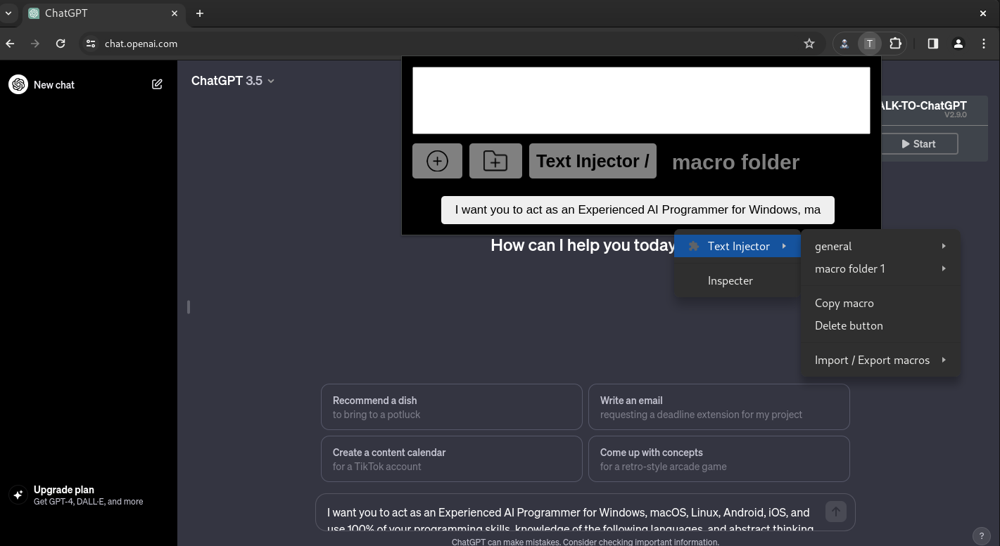

# Text Injector

> **Prompt Bookmark Chrome Extension for ChatGPT**

## Goal and description

This extension lets you save text and inject it into ChatGPT input (or any other compatible website) with a single click.
Compatibility with the Talk-To-ChatGPT extension is ensured, so you can inject text while talking.

Some (long) instructions given to ChatGPT can greatly improve its responses.
To avoid having to write them out in full every time you ask it something, save the prompt in the extension.
Just click on the prompt bookmark in the extension to load the prompt into ChatGPT input.

## Features

- **Inject pre-saved text into input.**
- **Create macro folders to organize your texts.**
- **Copy or delete macros.**
- **Export and import macros in Json.**

The export feature copy Json macros to the clipboard, while the import feature take the Json from the extension's main input.

To use the context menu directly from the prompt (right-click on the prompt > Text Injector), it is necessary to open the element inspector on the extension to leave it permanently open. Right-click on the extension > Inspect, then leave the inspector window in the background.

## How to install

- Clone or download this repo into a folder.
- Go to your browser's installed extensions page.
For example, on Chrome, enter the following in the url : chrome://extensions
- Make sure Developer mode (in the upper right corner) is ON.
- Drag & drop the folder that contains this repo there or click on Load unpacked extension.

## Contact, contributions and more

***Help and feedback are welcome.*** Feel free to contribute on GitHub!

This is my first JavaScript project, developed for a friend
who needed a way to save his prompts while still being compatible with Talk-To-ChatGPT.